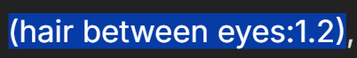
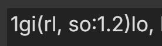
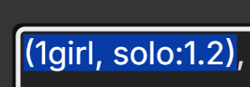
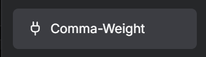
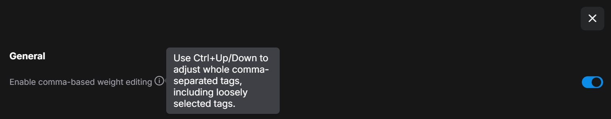

# ComfyUI Comma Weight

[English](README.md) | [中文](README.zh-CN.md) | [日本語](README.ja.md) | [한국어](README.ko.md)

ComfyUI のプロンプト入力欄で `Ctrl+↑/↓`（macOS では `Command+↑/↓`）を押すと、カンマ区切りのタグ全体の重みを調整できます。タグの途中にカーソルを置いたり、複数のタグを一部分だけ大まかに選択したりしても、カンマの境界まで範囲を広げます。

キャンバスにノードを追加しない ComfyUI のフロントエンド拡張です。

## 動作

`black hair, long hair, smile` の `hair, lo` だけを選択し、ComfyUI の変更幅を `0.2` に設定した状態で `Ctrl+↑` を1回押すと、次のようになります。

```text
black h[air, lo]ng hair, smile
             ↓
(black hair, long hair:1.2), smile
```

単一タグの一部を選択した場合と、2つのタグにまたがる一部を選択した場合の比較です。

| 選択範囲 | ComfyUI 標準の動作 | Comma Weight |
| --- | --- | --- |
| 単一タグの一部 |  |  |
| 2つのタグにまたがる一部 |  |  |

- `looking at viewer` の途中にカーソルを置いても、タグ全体が `(looking at viewer:1.2)` に変わります。
- 複数タグの一部を選択すると、両端のカンマ境界まで広げて1つのグループとして調整します。
- すでに重みが付いたグループでは、ショートカットを押すたびに現在の値を変更します。値が `1` に戻ると、重み付け用の括弧を外します。
- 対応する `()`, `[]`, `{}` の内側にあるカンマはタグの区切りとして扱いません。改行はタグを区切ります。
- 変更幅は ComfyUI の **Settings → Comfy → Edit Token Weight → Ctrl+up/down precision** の設定に従います。

## 設定

**Settings → Comma-Weight → General** で有効・無効を切り替えられます。変更はすぐに反映されます。無効にすると、ComfyUI 標準の `Ctrl+↑/↓` の動作に戻ります。





## インストール

### ComfyUI Manager

ComfyUI Manager で **Comma Weight** を検索してインストールしてください。その後、ComfyUI を再起動し、ブラウザを更新してください。

### 手動インストール

ComfyUI の `custom_nodes` フォルダで次のコマンドを入力してください。

```sh
git clone https://github.com/cozdx1/ComfyUI-Comma-Weight.git
```

ComfyUI を再起動し、ブラウザを更新してください。手動インストールを更新する場合は、クローンしたフォルダで `git pull` を実行してから、再起動とブラウザの更新を行ってください。

## 互換性

ComfyUI フロントエンド `1.51.9` で動作を確認しました。ショートカットは ComfyUI ページ内の編集可能なテキストエリアに適用されます。別のフロントエンドバージョンや同じショートカットを使う拡張機能がある場合は、意図どおりに動作しない可能性があります。

## 開発

JavaScript の動作テスト: `node --test tests/weight-range.test.mjs`

## ライセンス

[MIT](LICENSE)
